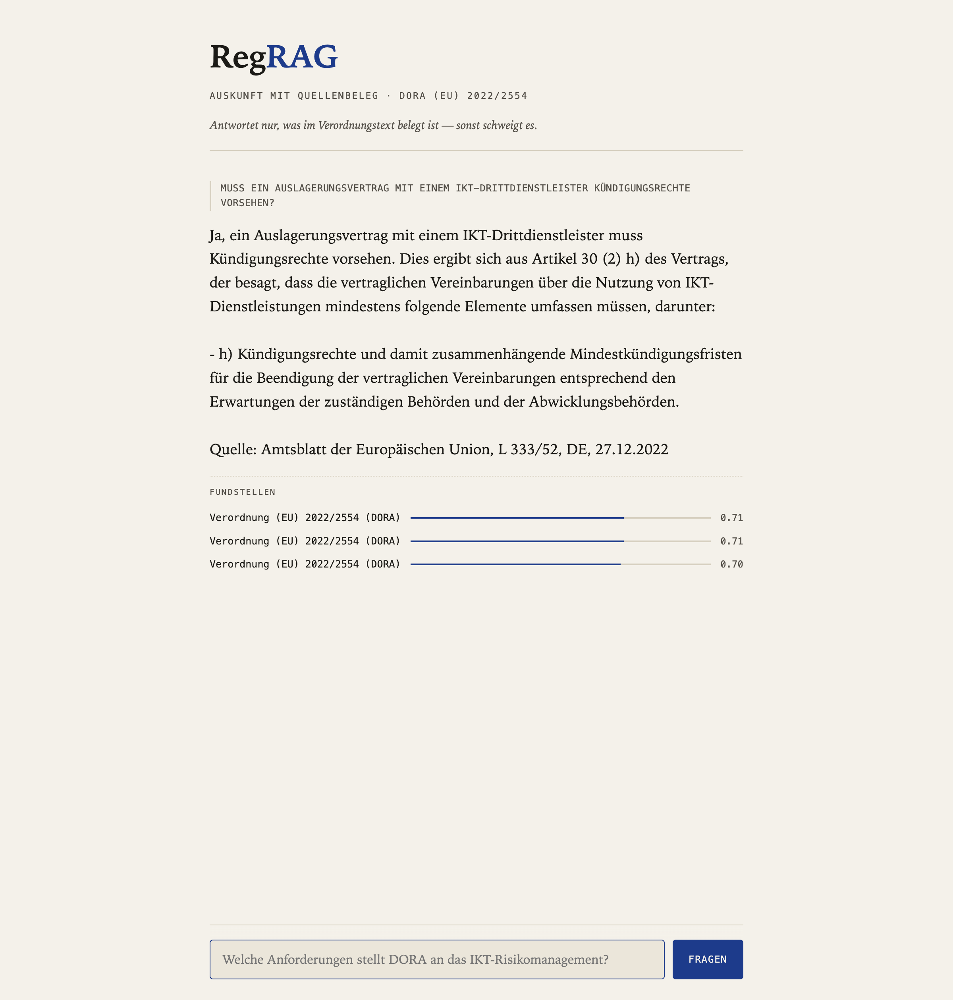

# RegRAG

Ein RAG-Agent, der beliebige PDFs (Verordnungen, Guidelines, Gesetzestexte, aber auch Lernmaterial oder Skripte) nach Markdown konvertiert und daraus einen belegpflichtigen Korpus macht: Fragen werden nur mit Quellenbeleg beantwortet — und der Agent bricht ehrlich ab, wenn die Beleglage zu dünn ist, statt zu halluzinieren. Das "Reg" im Namen meint diese Bindung an die Belege, nicht eine feste Domäne.

Gestartet ist RegRAG als Compliance-RAG über **DORA** (Verordnung (EU) 2022/2554). DORA bleibt der mitgelieferte Grundkorpus, aber über Upload und Löschen ist das System längst allgemein: DORA lässt sich entfernen, andere Dokumente treten an seine Stelle, mit denselben Garantien ([ADR 0008](docs/adr/0008-korpus-agnostisch-dora-ist-nur-der-seed.md)).

Gebaut, um RAG, LangGraph und LangChain praktisch zu verstehen. Kein Produktionssystem.



## Architektur

| Schicht | Baustein | Aufgabe |
|---|---|---|
| Retrieval | LlamaIndex | PDF → Markdown → Chunks → Embeddings → `retrieve` |
| Formulierung | LangChain | `ChatOpenAI` gegen LM Studio, PromptTemplate erzwingt Quellenangabe |
| Orchestrierung | LangGraph | Zustandsgraph: `retrieve` → `answer` |
| Speicher | ChromaDB | persistenter Vektor-Index, Cosine-Metrik |

Warum drei Frameworks und wo LangGraph seinen Platz noch nicht verdient: [ADR 0004](docs/adr/0004-rollenteilung-llamaindex-langchain-langgraph.md).

## Modelle: was läuft wo

| Rolle | Modell | Ort | Kosten |
|---|---|---|---|
| Embeddings | `BAAI/bge-m3` | lokal, im Prozess | 0 € |
| Generierung | `google/gemma-4-12b` | lokal, LM Studio (`localhost:1234`) | 0 € |
| Generierung (geplant, Issue #3) | frei wählbar | OpenRouter, gehostet | pay-as-you-go |

Embeddings laufen bewusst lokal: multilingual (DORA liegt auf Deutsch vor) und ohne Datenabfluss.
Die Generierung spricht ein OpenAI-kompatibles Interface — LM Studio und OpenRouter sind darüber austauschbar.

## Setup

```bash
python3 -m venv .venv && source .venv/bin/activate
pip install -r requirements.txt
```

LM Studio starten, ein Chat- und optional ein Embedding-Modell laden. Endpoint und Modellname kommen aus Umgebungsvariablen (Defaults in `config.py`, Vorlage in `env.example`).

### DORA-Rechtstext beschaffen

Der DORA-Text wird nicht im Repository mitgeliefert. Er ist auf EUR-Lex frei verfügbar:

1. PDF herunterladen: https://eur-lex.europa.eu/legal-content/DE/TXT/PDF/?uri=CELEX:32022R2554
2. Nach `docs/CELEX_32022R2554_DE_TXT.pdf` speichern.
3. `python convert.py` ausführen — das erzeugt `docs_md/CELEX_32022R2554_DE_TXT.md` und die `.source.json`.

Damit ist die Quelle nachvollziehbar reproduzierbar. Wiederverwendung gemäß Beschluss 2011/833/EU.

## Lauf

```bash
python convert.py   # PDF -> docs_md/CELEX_32022R2554_DE_TXT.md
python rag.py       # Mini-RAG: Antwort + Quellen-Scores
python agent.py     # LangGraph-Agent mit Abstain-Pfad
```

Der Vektor-Index wird beim ersten Lauf gebaut (~5 min) und danach aus `chroma/` geladen (12 s).
Neuaufbau erzwingen: `REGRAG_INDEX_NEU_BAUEN=1 python agent.py`.

## Web-UI

```bash
uvicorn web.main:app --reload      # http://localhost:8000
```

Chat-Seite mit token-für-token-Streaming (SSE). Jede Antwort nennt ihre Fundstellen mit Score; bei zu dünner Beleglage erscheint der Abstain-Zustand sichtbar statt einer erfundenen Antwort. `POST /chat` ist auch ohne UI nutzbar.

### Eigene Dokumente hochladen

Über die Seite lässt sich eine weitere PDF hinzufügen (z. B. MaRisk, EBA-Guidelines, NIS2). Der Upload nimmt an und gibt eine Job-ID zurück; die Indexierung läuft im Hintergrund, weil Embedding Minuten dauert und den Request nicht blockieren darf. Die Statuszeile meldet, sobald das Dokument durchsuchbar ist — sonst stellt man eine Frage, bekommt Abstain und hält das System für kaputt.

| Endpunkt | Zweck |
|---|---|
| `POST /upload` | PDF (validiert: Magic-Bytes, Größenlimit, Dateiname gesäubert) → `202` + Job-ID |
| `GET /jobs/{id}` | `pending` / `indexing` / `ready` / `failed` |
| `GET /documents` | Liste der indexierten Dokumente |
| `DELETE /documents/{datei}` | Dokument entfernen (Fingerprint, Nodes, Dateien) → `204` |

Das neue Dokument wird **inkrementell** in den bestehenden Chroma-Index gemerged, kein Voll-Rebuild ([ADR 0006](docs/adr/0006-inkrementeller-index-merge-statt-voll-rebuild.md)). Quellenangaben tragen den Dokumentnamen, sodass bei mehreren Korpora erkennbar bleibt, woher eine Aussage stammt.

Größenlimit: `REGRAG_UPLOAD_MAX_MB` (Default 25). **Keine urheberrechtlich geschützten Normtexte** (ISO, DIN) hochladen — die UI weist darauf hin.

Dokumente lassen sich über die Liste unter dem Chat auch wieder entfernen — inklusive DORA.
Der Korpus ist austauschbar; DORA ist nur der Seed, der beim ersten Start eines frischen
`docs_md`-Volumes angelegt wird (siehe [ADR 0008](docs/adr/0008-korpus-agnostisch-dora-ist-nur-der-seed.md)).
Entfernte Dokumente bleiben entfernt, auch über `docker compose restart`. `docker compose down -v`
verwirft das Volume und legt den DORA-Grundkorpus neu an.

## Docker

Empfohlen für den Grundkorpus: das DORA-PDF liegt lokal unter `docs/CELEX_32022R2554_DE_TXT.pdf`
bereit (siehe [DORA-Rechtstext beschaffen](#dora-rechtstext-beschaffen)). Fehlt es, startet der
Container trotzdem — mit leerem Korpus und einem Hinweis dazu auf stdout ([ADR 0008](docs/adr/0008-korpus-agnostisch-dora-ist-nur-der-seed.md)).

```bash
docker compose up --build
```

Das Image backt `BAAI/bge-m3` ein (offline lauffähig). Der Container spricht per Default über `host.docker.internal:1234` das LM Studio auf dem Host an — das funktioniert auf **macOS**. Für Linux/Cloud, wo eine Mac-Desktop-App nicht erreichbar ist, zeigt man `REGRAG_LLM_BASE_URL` auf einen gehosteten Worker (OpenRouter) oder einen headless lokalen Server; siehe `env.example` und [arc42 Kap. 7](docs/arc42.md).

Zwei Volumes: `chroma` trägt die Vektoren, `docs_md` den Korpus. Beide zusammen lassen hochgeladene Dokumente einen `docker compose restart` überleben — gemessen: Kaltstart 360 s, Neustart 31 s ohne erneutes Embedden.

## Stand

- [x] **Step 1** — Mini-RAG über DORA, Antwort mit Belegstellen
- [x] **Step 2** — LangGraph-Agent, Abstain als bedingte Kante, Schwellwert kalibriert (14/14), Faithfulness gemessen (Ø 0.93) ([#2](../../issues/2))
- [x] **Persistenz** — Chroma-Index, Warmstart 12 s statt 5 min ([#1](../../issues/1))
- [x] **Index-Integrität** — Fingerprint-Validierung, Neuaufbau bei geänderter Quelle ([#7](../../issues/7))
- [x] **Web-UI + Docker** — FastAPI, SSE-Streaming, Container mit eingebackenem Embedding-Modell ([#3](../../issues/3))
- [x] **Dokumenten-Upload** — PDF hochladen, inkrementeller Merge im Hintergrund, Job-Status ([#4](../../issues/4))

## Evaluation

```bash
python -m evaluation.calibrate   # misst Score-Trennung, schlägt Schwellwert vor
python -m evaluation.run         # Guard-Entscheidungen (14/14) + Faithfulness
```

Das Eval-Set (`evaluation/dataset.py`) enthält 8 beantwortbare DORA-Fragen und 6 themenfremde. Der Guard trennt sie 14/14. Faithfulness (`deepeval`, Judge über `with_structured_output`) ist über die 8 beantworteten Fälle **gemessen: Ø 0.93** (Spanne 0.71–1.00, fünfmal 1.00). Der schwächste Fall ist TLPT (0.71) — die Antwort trägt dort Aussagen, die die drei abgerufenen Chunks nicht vollständig decken.

Der Judge läuft getrennt vom Antwortmodell: Die App generiert lokal (LM Studio), nur die Bewertung geht an einen gehosteten OpenAI-kompatiblen Endpunkt. Ein lokaler Judge ist auf dem M4 nicht praktikabel — schema-gebundene Extraktion über dichte Rechtstexte reißt die Timeouts ([ADR 0005](docs/adr/0005-guard-kalibriert-abstain-als-bedingte-kante.md)).

```bash
REGRAG_JUDGE_BASE_URL=https://openrouter.ai/api/v1 \
REGRAG_JUDGE_MODELL=openai/gpt-5.4-mini \
REGRAG_JUDGE_API_KEY=sk-or-... \
python -m evaluation.run
```

Im Container geht derselbe Lauf über `docker compose run --rm regrag python -m evaluation.run`; die vier `REGRAG_JUDGE_*`-Variablen reicht Compose durch.

## Dokumentation

- [Architekturdokumentation (arc42)](docs/arc42.md) — Kontext, Bausteine, Laufzeit, und die technischen Schulden ungeschönt in Kapitel 11.

## Entscheidungen (ADRs)

- [0001](docs/adr/0001-pdf-nach-markdown-statt-pdf-direkt.md) — PDF nach Markdown, statt das PDF direkt zu indexieren
- [0002](docs/adr/0002-abstain-statt-raten.md) — Verweigern statt raten
- [0003](docs/adr/0003-persistenter-chroma-index-mit-cosine.md) — Persistenter Chroma-Index, erzwungen auf Cosine
- [0004](docs/adr/0004-rollenteilung-llamaindex-langchain-langgraph.md) — Rollenteilung der drei Frameworks (LangGraph-Schuld eingelöst)
- [0005](docs/adr/0005-guard-kalibriert-abstain-als-bedingte-kante.md) — Guard kalibriert, Abstain als bedingte Kante
- [0006](docs/adr/0006-inkrementeller-index-merge-statt-voll-rebuild.md) — Inkrementeller Index-Merge statt Voll-Rebuild
- [0007](docs/adr/0007-sprachgrenze-im-code.md) — Sprachgrenze im Code: Domäne deutsch, Technik englisch
- [0008](docs/adr/0008-korpus-agnostisch-dora-ist-nur-der-seed.md) — Korpus-agnostisch: DORA ist nur der Seed

## Gemessen

| Größe | Wert |
|---|---|
| Kaltstart (Index bauen, 351k Zeichen) | 5:04 min lokal, 6:00 min im Container |
| Warmstart (Index laden) | 12.2 s lokal, 31 s im Container (DORA + NIS2) |
| Upload eines zweiten Dokuments (NIS2, 1.3 MB) bis `ready` | ~250 s — nur das neue Dokument wird embeddet |
| Retrieval (`similarity_top_k=3`) | 0.5 s |
| Score beantwortbarer DORA-Fragen | 0.67–0.78 |
| Score themenfremder Fragen | 0.48–0.57 |
| `MIN_RETRIEVAL_SCORE` (Lückenmitte) | 0.62 |
| Guard-Trennung über das Eval-Set | 14/14 |
| Faithfulness der 8 beantworteten Fälle (Judge: `openai/gpt-5.4-mini`) | Ø 0.93 (0.71–1.00) |
| Antwortlatenz lokal (gemma-4-12b, ~5k Prompt-Tokens) | 1–3 min |

Der Score ist `exp(-Distanz)`, nicht rohe Cosine-Similarity — nur innerhalb dieser Transformation interpretierbar (ADR 0003). Noch offen: Grenzfälle nahe der Schwelle (Finanzregulatorik außerhalb DORA) und die Qualität gegenüber naivem PDF-Parsing.

## Quellen

DORA-Text: EUR-Lex, CELEX 32022R2554. Wiederverwendung gemäß Beschluss 2011/833/EU.
ISO- und DIN-Normtexte sind urheberrechtlich geschützt und werden bewusst nicht eingebettet — auch nicht über den Upload.
Hochgeladene Dokumente verlassen den Rechner nicht: das Embedding läuft im Prozess, nur die Frage und die gefundenen Chunks gehen an das Generierungsmodell.
