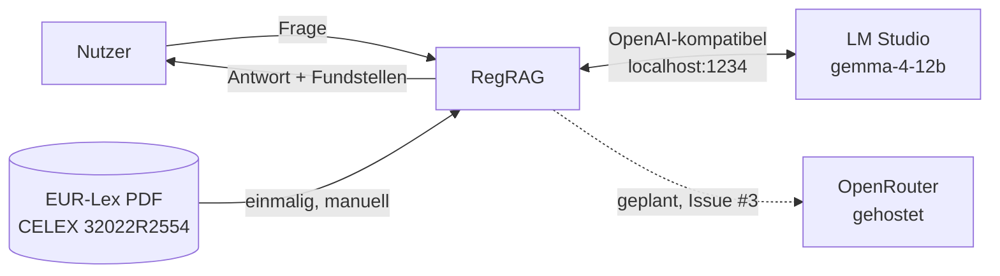
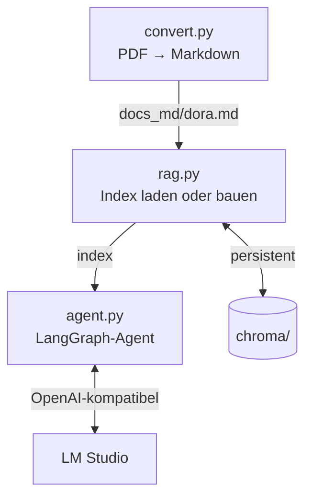
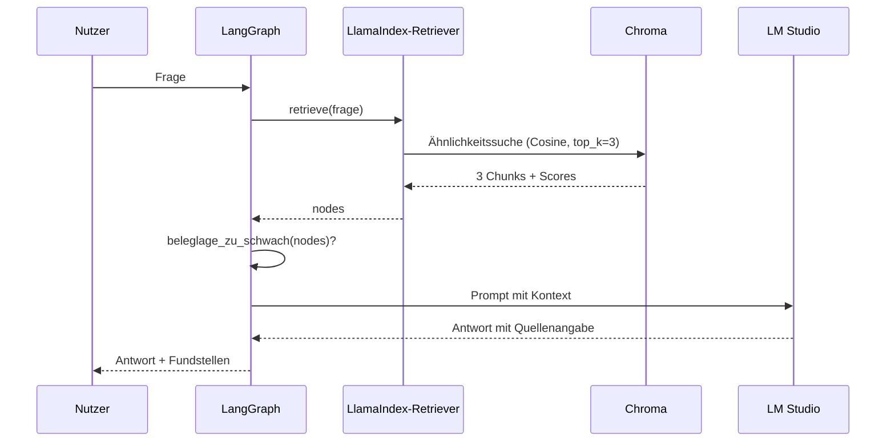

# RegRAG — Architekturdokumentation (arc42)

Stand: Juli 2026. Gliederung nach [arc42](https://arc42.org).

Diese Dokumentation beschreibt ein **Lernprojekt**, kein Produktionssystem. Kapitel, die
für dieses System nichts Substanzielles hergeben, sind als solche markiert statt mit
Textbausteinen gefüllt.

---

## 1. Einführung und Ziele

RegRAG beantwortet Fragen zur **Verordnung (EU) 2022/2554 (DORA)** ausschließlich auf
Basis des Verordnungstextes und weist die Fundstellen aus. Findet das System keinen
belastbaren Beleg, verweigert es die Antwort, statt eine zu erfinden.

### Qualitätsziele

| # | Ziel | Warum | Wie geprüft |
|---|---|---|---|
| Q1 | **Nachvollziehbarkeit** — jede Antwort nennt ihre Fundstellen | Eine Compliance-Aussage ohne Beleg ist wertlos | Quellen + Scores werden ausgegeben |
| Q2 | **Keine erfundenen Antworten** — lieber schweigen | Eine falsche Aussage zu DORA ist teurer als keine | ❌ **gemessen verletzt**: Guard greift nicht, siehe Kapitel 11 |
| Q3 | **Datenhoheit** — Dokumente verlassen den Rechner nicht | Reguliertes Umfeld; Embeddings laufen lokal | Embeddings im Prozess, LLM auf `localhost` |
| Q4 | **Nachvollziehbare Kosten und Latenz** | Grundlage für die Wahl lokal vs. gehostet | Kapitel 10, gemessene Werte |

Q2 ist das eigentliche Versprechen des Systems — und das einzige Qualitätsziel, für das
es bis heute **keinen Nachweis** gibt.

### Stakeholder

| Rolle | Erwartung |
|---|---|
| Entwickler (Gereon) | RAG, LangGraph und LangChain praktisch verstehen, nicht nur benutzen |
| Fachgespräch / Review | Nachvollziehbare Entscheidungen und ehrlich benannte Grenzen |
| Fachanwender (hypothetisch) | Schnelle, belegte Antwort auf eine DORA-Frage |

---

## 2. Randbedingungen

| Randbedingung | Konsequenz |
|---|---|
| Entwicklung auf einem Mac (Apple Silicon) | LM Studio ist eine Desktop-App, kein Serverdienst — siehe Kapitel 7 |
| Kein Budget für gehostete LLM-Inferenz im MVP | Generierung lokal, gehosteter Worker erst später |
| DORA liegt auf Deutsch vor | Embedding-Modell muss multilingual sein → `BAAI/bge-m3` |
| ISO-Normtexte sind urheberrechtlich geschützt | Werden bewusst **nicht** eingebettet. EU-Recht dagegen ist nach Beschluss 2011/833/EU frei verwendbar |
| Lernprojekt neben einer Bewerbung | Ehrlichkeit vor Vollständigkeit: keine Zahl im README, die nicht gemessen wurde |

---

## 3. Kontextabgrenzung



Fachlich: Der Nutzer stellt eine Frage in natürlicher Sprache und erhält entweder eine
belegte Antwort oder eine begründete Verweigerung.

Technisch: Das einzige verpflichtende externe System ist ein **OpenAI-kompatibler
Chat-Endpunkt**. Welcher Anbieter dahintersteht, ist bewusst austauschbar gehalten —
heute allerdings noch über hartkodierte Werte in `agent.py`, nicht über Konfiguration
(siehe Kapitel 8 und Schuld 6 in Kapitel 11). Das Embedding-Modell läuft **im Prozess**,
nicht als Dienst.

---

## 4. Lösungsstrategie

| Qualitätsziel | Ansatz | Entscheidung |
|---|---|---|
| Q1 Nachvollziehbarkeit | Retrieval liefert Knoten mit Score und Dateiname; das Prompt-Template verpflichtet auf Quellenangabe | — |
| Q2 Keine Halluzination | Schwellwert auf dem Retrieval-Score. Reißt er, sieht das LLM den Kontext gar nicht erst | [ADR 0002](adr/0002-abstain-statt-raten.md) |
| Q1 Chunk-Qualität | PDF → Markdown, damit Chunks entlang Artikeln fallen, nicht entlang Seitenspalten | [ADR 0001](adr/0001-pdf-nach-markdown-statt-pdf-direkt.md) |
| Q4 Latenz | Vektor-Index persistieren statt bei jedem Start neu zu embedden | [ADR 0003](adr/0003-persistenter-chroma-index-mit-cosine.md) |
| Q3 Datenhoheit | Embeddings lokal, LLM über austauschbares OpenAI-Interface | [ADR 0004](adr/0004-rollenteilung-llamaindex-langchain-langgraph.md) |

---

## 5. Bausteinsicht

### Ebene 1



| Baustein | Verantwortung | Kennt **nicht** |
|---|---|---|
| `convert.py` | PDF nach Markdown wandeln (`pymupdf4llm`) | Embeddings, LLM |
| `rag.py` | Embedding-Modell, Index bauen/laden, Persistenz | Den Ablauf, das LLM |
| `agent.py` | Ablaufsteuerung, Schwellwert, Prompt, LLM-Aufruf | Wie retrievt wird |

Die Trennung ist der Punkt: `rag.py` weiß nichts vom LLM, `agent.py` nichts vom Vektor-Store.
Ein Austausch von Chroma oder LM Studio berührt jeweils genau eine Datei.

### Ebene 2 — `agent.py`

| Element | Aufgabe |
|---|---|
| `retrieve` (Knoten) | Die drei ähnlichsten Chunks holen |
| `answer` (Knoten) | Beleglage prüfen, dann formulieren **oder** verweigern |
| `beleglage_zu_schwach()` | Der Schwellwert-Test, siehe ADR 0002 |
| `StateGraph` | Verbindet die Knoten, trägt den Zustand `S` |

⚠️ `answer` tut heute **zwei Dinge**: prüfen und formulieren. Siehe Kapitel 11.

---

## 6. Laufzeitsicht

### Anfrage mit ausreichender Beleglage



### Anfrage ohne Beleg

So die Absicht: `beleglage_zu_schwach()` liefert `True`, `answer` setzt `ABSTAIN_ANTWORT`,
das LLM wird nie aufgerufen und kann nicht halluzinieren, was es nicht sieht.

**Gemessen tut der Pfad das heute nicht.** Off-Topic-Fragen ("Wie backe ich einen
Kuchen?", "Hauptstadt von Australien?") erzielen Retrieval-Scores von **0.48–0.51** und
liegen damit **über** `MIN_RETRIEVAL_SCORE = 0.4` — der Abstain-Pfad greift nicht, die
Verweigerung findet nicht statt. Ursache und Konsequenz stehen in Schuld 2 (Kapitel 11).
Das zentrale Versprechen des Systems ist damit aktuell **nicht eingelöst**.

### Indexaufbau (einmalig)

`convert.py` → Markdown → Chunks → bge-m3 → Chroma. Dauer: **5:04 min** für 351k Zeichen.
Danach lädt jeder Start den Index in **12.2 s**, wovon der Löwenanteil das Laden des
Embedding-Modells in den Speicher ist.

---

## 7. Verteilungssicht

### Heute

Alles auf einem Rechner: ein Python-Prozess (Embeddings im Prozess, Chroma auf Platte)
spricht über `localhost:1234` mit LM Studio.

### Geplant (Issue #3) — und die Falle darin

```mermaid
graph TD
    subgraph Container
        API[FastAPI + Index]
    end
    subgraph Host
        LMS[LM Studio]
    end
    API -.host.docker.internal.-> LMS
    API -->|Alternative| OR[OpenRouter]
```

**LM Studio als Mac-Desktop-App ist aus dem Container nicht erreichbar.** Der Container
käme nur über `host.docker.internal` an sie heran — was auf einem Linux-Server oder in
der Cloud nicht funktioniert.

Das erzwingt aber **nicht** zwingend gehostete Inferenz. Der Container braucht lediglich
*irgendeinen* erreichbaren OpenAI-kompatiblen Endpunkt. Das kann ein headless lokaler
Server sein (LM Studio im Headless-Betrieb, oder llama.cpp / vLLM / Ollama im Container),
oder ein gehosteter Worker (OpenRouter). Es ist also eine **Deployment-Entscheidung**
zwischen Kosten, Datenhoheit und Betriebsaufwand — keine technische Notwendigkeit.
Was der Umbau in jedem Fall verlangt: Die Backend-URL muss konfigurierbar werden statt
hartkodiert (Schuld 6). Zweitens wiegt `bge-m3` ~2 GB und muss ins Image oder in ein
Volume — bewusst zu entscheiden.

---

## 8. Querschnittliche Konzepte

**Entscheidungen gehören in ADRs, nicht in Kommentare.** Der Code trägt sprechende Namen
(`beleglage_zu_schwach`, `MIN_RETRIEVAL_SCORE`, `ABSTAIN_ANTWORT`) und verweist per
`# docs/adr/0002` auf die Begründung. Erklärende Kommentare sind projektweit unerwünscht:
Was der Code tut, sagt der Code; warum, sagt die ADR.

**Ehrlichkeit als Architekturprinzip.** Keine Zahl in README, ADR oder Bewerbung, die nicht
gemessen wurde. Nicht Gemessenes wird als „offen" markiert, nicht weggelassen.
Ein Score ist nur innerhalb seiner Distanzmetrik interpretierbar (ADR 0003).

**Austauschbarkeit über OpenAI-kompatible Schnittstellen.** LM Studio und OpenRouter
sprechen dasselbe Protokoll. Der Wechsel *soll* reine Konfiguration sein — heute ist er
es noch nicht: Base-URL, Modellname und API-Key stehen in `agent.py` und `rag.py`
hartkodiert. Bis Issue #3 diese Werte in Umgebungsvariablen zieht, verlangt ein
Backendwechsel eine Codeänderung. Das Prinzip gilt, die Umsetzung steht aus (Schuld 6).

---

## 9. Architekturentscheidungen

| ADR | Entscheidung | Status |
|---|---|---|
| [0001](adr/0001-pdf-nach-markdown-statt-pdf-direkt.md) | PDF nach Markdown statt PDF direkt | akzeptiert; Nutzen **nicht gemessen** |
| [0002](adr/0002-abstain-statt-raten.md) | Verweigern statt raten | akzeptiert; Schwellwert **unkalibriert** |
| [0003](adr/0003-persistenter-chroma-index-mit-cosine.md) | Persistenter Chroma-Index, Cosine erzwungen | akzeptiert |
| [0004](adr/0004-rollenteilung-llamaindex-langchain-langgraph.md) | Rollenteilung der drei Frameworks | akzeptiert; LangGraph **unterfordert** |

---

## 10. Qualitätsanforderungen

### Gemessen

| Größe | Wert |
|---|---|
| Kaltstart (Index bauen, 351k Zeichen) | 5:04 min |
| Warmstart (Index laden) | 12.2 s |
| Retrieval, `similarity_top_k=3` | 0.5 s |
| Score eines guten Treffers (On-Topic) | 0.72–0.73 |
| Score bei Off-Topic-Unsinnsfragen | 0.48–0.51 |
| Kosten pro Anfrage (lokal) | 0 € |

Der Score von ChromaVectorStore ist `exp(-Distanz)`, **nicht** die rohe Cosine-Similarity
(LlamaIndex, `chroma/base.py:472`). Ein guter Treffer mit Cosine ≈ 0.68 wird als 0.72
berichtet, eine Unsinnsfrage mit Cosine ≈ 0.32 noch als 0.50. Scores sind nur innerhalb
dieser Transformation und gegen den konkreten Store interpretierbar.

### Szenarien

| Szenario | Erwartung | Status |
|---|---|---|
| Frage, die DORA beantwortet | Antwort mit Fundstellen | ✅ beobachtet |
| Frage außerhalb von DORA | `ABSTAIN_ANTWORT`, kein LLM-Aufruf | ❌ **gemessen fehlgeschlagen** (Unsinn scort 0.48–0.51 > 0.4) |
| LM Studio nicht erreichbar | Verständliche Fehlermeldung, kein Absturz | ⚠️ `except Exception` fängt alles |
| Vektor-Store gewechselt | Schwellwert wird neu kalibriert | ✅ als Regel etabliert (ADR 0003) |

### Nicht gemessen

Faithfulness. Trefferqualität gegenüber naivem PDF-Parsing. Ob `MIN_RETRIEVAL_SCORE = 0.4`
richtig liegt. Latenz und Kosten eines gehosteten Backends. Alles Gegenstand von Issue #2 und #3.

---

## 11. Risiken und technische Schulden

| # | Schuld | Wirkung | Wo |
|---|---|---|---|
| 1 | **Abstain-Pfad nie ausgelöst** | Das zentrale Qualitätsversprechen (Q2) ist unbewiesen | ADR 0002, Issue #2 |
| 2 | **`MIN_RETRIEVAL_SCORE = 0.4` liegt unter dem Rauschboden** | Gemessen: Off-Topic-Unsinnsfragen erzielen 0.48–0.51, also **über** der Schwelle. Der Score ist `exp(-Distanz)`, nicht rohe Cosine-Similarity — 0.4 entspricht Cosine ≈ 0.08 (praktisch unabhängig). Der Abstain-Guard ist damit **de facto wirkungslos**, nicht bloß unkalibriert | ADR 0002, ADR 0003, Issue #2 |
| 3 | **LangGraph ist unterfordert** | Der Graph ist eine gerade Linie; die Verzweigung steckt als `if` im `answer`-Knoten. Ein bedingter Kanten-Übergang würde die Verweigerung sichtbar machen | ADR 0004 |
| 4 | **Keine automatisierten Tests** | Jede Änderung wird von Hand geprüft. `deepeval` steht in `requirements.txt`, wird von keiner Datei importiert | Issue #2 |
| 5 | **`except Exception` in `answer`** | Verschluckt jeden Fehler, auch Programmierfehler, und meldet dem Nutzer „bitte erneut versuchen" | `agent.py` |
| 6 | **Modellname hartkodiert** | `LOKALES_CHAT_MODELL` ist eine Konstante; für Docker muss sie aus der Umgebung kommen | Issue #3 |
| 7 | **Chunking ungetunt** | LlamaIndex-Defaults. Für einen Gesetzestext mit Artikelstruktur vermutlich nicht optimal | offen |

Schuld 1 bis 3 sind die interessanten. Sie betreffen nicht die Ausführung, sondern die
**Aussagekraft** des Systems — es tut, was es soll, aber niemand hat es bewiesen.

---

## 12. Glossar

| Begriff | Bedeutung |
|---|---|
| **DORA** | Digital Operational Resilience Act, Verordnung (EU) 2022/2554. **In Kraft getreten** Anfang 2023 (20 Tage nach Veröffentlichung im Amtsblatt vom 27.12.2022), **anwendbar seit 17. Januar 2025** (Art. 64). Löst die BAIT ab; die BAIT gilt in der Übergangszeit fort und wird erst nach dem 31.12.2026 vollständig aufgehoben |
| **RAG** | Retrieval-Augmented Generation. Erst passende Textstellen suchen, dann das LLM nur auf deren Basis antworten lassen |
| **Chunk** | Ein Textabschnitt, in den ein Dokument zerlegt wird, um einzeln durchsuchbar zu sein |
| **Embedding** | Ein Vektor, der die Bedeutung eines Chunks repräsentiert. Ähnliche Bedeutung → nahe Vektoren |
| **Cosine / L2** | Zwei Arten, „Nähe" zwischen Vektoren zu messen. Ihre Zahlen sind **nicht** ineinander übersetzbar (ADR 0003) |
| **HNSW** | Der Suchindex in Chroma. Findet Nachbarn schnell, aber **näherungsweise** statt exakt |
| **Abstain** | Die bewusste Verweigerung einer Antwort bei zu dünner Beleglage |
| **Faithfulness** | Metrik: Steht die Antwort tatsächlich im gelieferten Kontext, oder wurde sie erfunden? |
