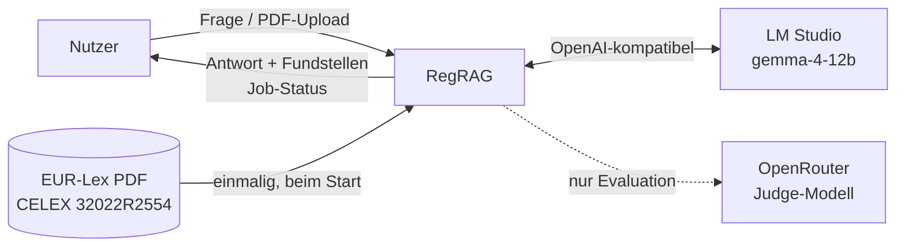
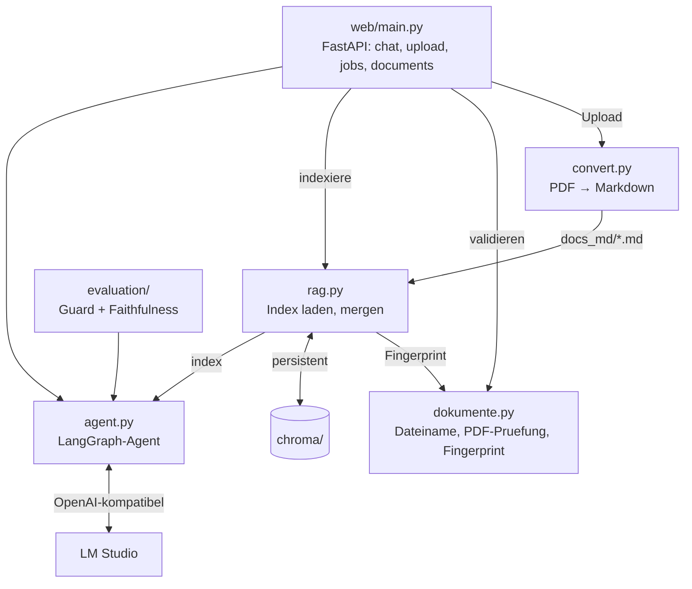
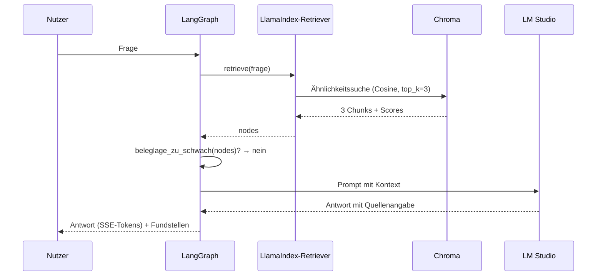
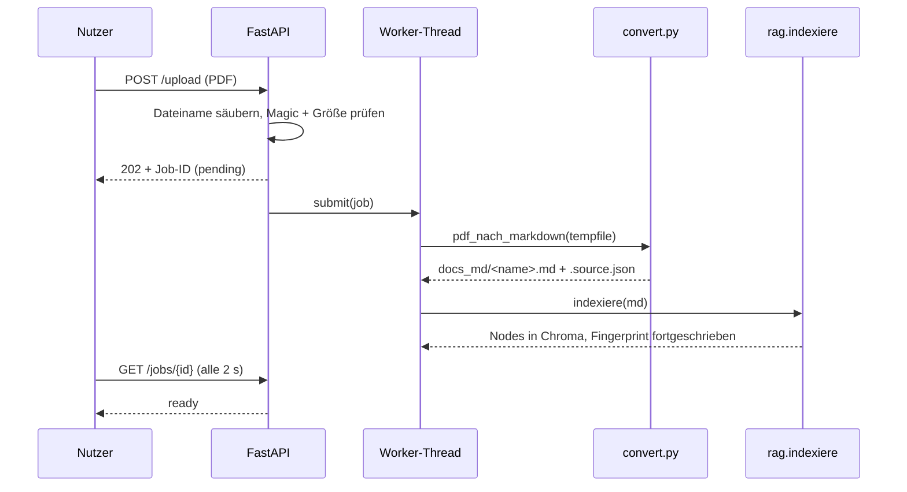

# RegRAG — Architekturdokumentation (arc42)

Stand: Juli 2026, nach Issue #4 (Dokumenten-Upload). Gliederung nach [arc42](https://arc42.org).

Diese Dokumentation beschreibt ein **Lernprojekt**, kein Produktionssystem. Kapitel, die
für dieses System nichts Substanzielles hergeben, sind als solche markiert statt mit
Textbausteinen gefüllt.

---

## 1. Einführung und Ziele

RegRAG beantwortet Fragen zu **regulatorischen Texten** ausschließlich auf Basis der
indexierten Dokumente und weist die Fundstellen aus. Findet das System keinen belastbaren
Beleg, verweigert es die Antwort, statt eine zu erfinden.

Der Grundkorpus ist die **Verordnung (EU) 2022/2554 (DORA)**. Seit Issue #4 lassen sich über
die Web-UI weitere PDFs hinzufügen (MaRisk, EBA-Guidelines, NIS2); sie werden im Hintergrund
indexiert und danach mitdurchsucht.

### Qualitätsziele

| # | Ziel | Warum | Wie geprüft |
|---|---|---|---|
| Q1 | **Nachvollziehbarkeit** — jede Antwort nennt ihre Fundstellen | Eine Compliance-Aussage ohne Beleg ist wertlos | Quellen + Scores in UI und API; bei mehreren Korpora mit Dokumentnamen |
| Q2 | **Keine erfundenen Antworten** — lieber schweigen | Eine falsche Aussage zu DORA ist teurer als keine | ✅ **gemessen**: Guard trennt 14/14 Fälle; Faithfulness Ø 0.93 über die beantworteten Fälle |
| Q3 | **Datenhoheit** — Dokumente verlassen den Rechner nicht | Reguliertes Umfeld | Embeddings im Prozess, Generierung gegen einen frei wählbaren Endpunkt (Default: LM Studio auf `localhost`) |
| Q4 | **Nachvollziehbare Kosten und Latenz** | Grundlage für die Wahl lokal vs. gehostet | Kapitel 10, ausschließlich gemessene Werte |

Q2 war lange das uneingelöste Versprechen des Systems. Seit der Kalibrierung des Schwellwerts
(ADR 0005) ist es gemessen — und bleibt die Größe, an der das System scheitert oder besteht.

### Stakeholder

| Rolle | Erwartung |
|---|---|
| Entwickler (Gereon) | RAG, LangGraph und LangChain praktisch verstehen, nicht nur benutzen |
| Fachgespräch / Review | Nachvollziehbare Entscheidungen und ehrlich benannte Grenzen |
| Fachanwender (hypothetisch) | Schnelle, belegte Antwort — und die Möglichkeit, eigene Regulatorik hinzuzufügen |

---

## 2. Randbedingungen

| Randbedingung | Konsequenz |
|---|---|
| Entwicklung auf einem Mac (Apple Silicon) | LM Studio ist eine Desktop-App, kein Serverdienst — siehe Kapitel 7 |
| Kein Budget für gehostete LLM-Inferenz im Regelbetrieb | Generierung lokal; nur der Eval-Judge läuft gehostet (ADR 0005) |
| DORA liegt auf Deutsch vor | Embedding-Modell muss multilingual sein → `BAAI/bge-m3` |
| ISO- und DIN-Normtexte sind urheberrechtlich geschützt | Werden **nicht** eingebettet; die Upload-UI weist ausdrücklich darauf hin. EU-Recht ist nach Beschluss 2011/833/EU frei verwendbar |
| Embedding ist CPU-gebunden und dauert Minuten | Upload darf den Request nicht blockieren → Job-Modell (Kapitel 6) |
| Lernprojekt neben einer Bewerbung | Ehrlichkeit vor Vollständigkeit: keine Zahl im README, die nicht gemessen wurde |

---

## 3. Kontextabgrenzung



Fachlich: Der Nutzer stellt eine Frage und erhält entweder eine belegte Antwort oder eine
begründete Verweigerung. Zusätzlich kann er eigene PDFs hochladen und sieht, ab wann sie
durchsuchbar sind.

Technisch: Das einzige verpflichtende externe System ist ein **OpenAI-kompatibler
Chat-Endpunkt**; welcher Anbieter dahintersteht, ist Konfiguration (`config.py`, Vorlage in
`env.example`). Das Embedding-Modell läuft **im Prozess**, nicht als Dienst. Der Judge der
Evaluation ist bewusst ein **anderes** Modell an einem anderen Endpunkt (ADR 0005) und im
Regelbetrieb nicht beteiligt.

---

## 4. Lösungsstrategie

| Qualitätsziel | Ansatz | Entscheidung |
|---|---|---|
| Q1 Nachvollziehbarkeit | Retrieval liefert Knoten mit Score, Dateiname und Dokumenttitel; das Prompt-Template verpflichtet auf Quellenangabe | — |
| Q2 Keine Halluzination | Kalibrierter Schwellwert auf dem Retrieval-Score, als **bedingte Kante** im Graphen. Reißt er, sieht das LLM den Kontext gar nicht erst | [ADR 0002](adr/0002-abstain-statt-raten.md), [ADR 0005](adr/0005-guard-kalibriert-abstain-als-bedingte-kante.md) |
| Q1 Chunk-Qualität | PDF → Markdown, damit Chunks entlang Artikeln fallen, nicht entlang Seitenspalten | [ADR 0001](adr/0001-pdf-nach-markdown-statt-pdf-direkt.md) |
| Q4 Latenz | Vektor-Index persistieren; neue Dokumente **inkrementell** mergen statt neu zu bauen | [ADR 0003](adr/0003-persistenter-chroma-index-mit-cosine.md), [ADR 0006](adr/0006-inkrementeller-index-merge-statt-voll-rebuild.md) |
| Q3 Datenhoheit | Embeddings lokal, Generierung über austauschbares OpenAI-Interface | [ADR 0004](adr/0004-rollenteilung-llamaindex-langchain-langgraph.md) |

---

## 5. Bausteinsicht

### Ebene 1



| Baustein | Verantwortung | Kennt **nicht** |
|---|---|---|
| `dokumente.py` | Dateinamen säubern, PDF prüfen, Fingerprint und Diff bilden | Chroma, LlamaIndex, FastAPI — bewusst importfrei, damit die CI ihn ohne schwere Dependencies testen kann |
| `convert.py` | PDF nach Markdown wandeln (`pymupdf4llm`), Quellen-Sidecar schreiben | Embeddings, LLM |
| `rag.py` | Embedding-Modell, Index laden, Dokumente inkrementell mergen | Den Ablauf, das LLM |
| `agent.py` | Ablaufsteuerung, Schwellwert als bedingte Kante, Prompt, LLM-Aufruf | Wie retrievt wird |
| `web/main.py` | HTTP: Chat mit SSE-Streaming, Upload, Job-Status, Dokumentliste | Wie indexiert oder retrievt wird |
| `evaluation/` | Guard-Trennschärfe kalibrieren und messen, Faithfulness bewerten | Den Produktionspfad — liest nur mit |

Die Trennung ist der Punkt: `rag.py` weiß nichts vom LLM, `agent.py` nichts vom Vektor-Store,
`web/main.py` nichts von beidem außer den Aufrufen. `dokumente.py` weiß von gar nichts — deshalb
liegt dort die Logik, die Tests brauchen.

### Ebene 2 — `agent.py`

| Element | Aufgabe |
|---|---|
| `retrieve` (Knoten) | Die drei ähnlichsten Chunks holen |
| `answer` (Knoten) | Formulieren — sieht den Kontext nur, wenn der Guard ihn durchlässt |
| `abstain` (Knoten) | `ABSTAIN_ANTWORT` setzen, ohne das LLM zu berühren |
| `beleglage_zu_schwach()` | Der Schwellwert-Test, siehe ADR 0002 und 0005 |
| `naechster_schritt()` | Die bedingte Kante: `answer` oder `abstain` |

### Ebene 2 — `rag.py`

| Element | Aufgabe |
|---|---|
| `lade_oder_baue_index()` | Beim Start: Fingerprint-Diff bilden und abfahren |
| `indexiere(md_pfad)` | Ein Dokument in die bestehende Collection mergen — der **einzige** Indexierungspfad, geteilt von Start und Upload |
| `loesche_nodes(dateiname)` | Nodes eines Dokuments über das Metadatenfeld `file_name` entfernen |
| `FINGERPRINT_DATEI` | `{datei: sha256}` — zugleich das Inventar des Index (ADR 0006) |

---

## 6. Laufzeitsicht

### Anfrage mit ausreichender Beleglage



### Anfrage ohne Beleg

`beleglage_zu_schwach()` liefert `True`, die bedingte Kante führt nach `abstain`, das LLM wird
nie aufgerufen und kann nicht halluzinieren, was es nicht sieht.

**Das ist gemessen, nicht behauptet:** Über 14 Fälle (8 beantwortbare DORA-Fragen, 6 themenfremde)
trennt der Guard bei `MIN_RETRIEVAL_SCORE = 0.62` **14/14** korrekt (ADR 0005, `evaluation/run.py`).

### Upload eines Dokuments (Issue #4)



Der Worker-Pool hat **genau einen** Thread: Embedding ist CPU-gebunden, parallele Jobs würden
sich gegenseitig ausbremsen und die laufende Chat-Anfrage mit. Die hochgeladene PDF liegt nur
in einem `tempfile`; persistiert werden Markdown und Sidecar.

### Start und Neustart

Beim Start bildet `rag.py` den Fingerprint über `docs_md/` und vergleicht ihn mit dem Inventar
im Chroma-Volume. Gleich → nichts tun. Neue oder geänderte Datei → nur diese indexieren.
Modell- oder Metrikwechsel → Voll-Rebuild (ADR 0006).

Gemessen: Kaltstart mit DORA **360 s**. Neustart mit DORA **und** NIS2 (nichts zu tun): **31 s**.

---

## 7. Verteilungssicht

```mermaid
graph TD
    subgraph Container
        API[FastAPI + Index + bge-m3]
        VOL1[(Volume: chroma)]
        VOL2[(Volume: docs_md)]
        API --- VOL1
        API --- VOL2
    end
    subgraph Host
        LMS[LM Studio]
    end
    API -.host.docker.internal:1234.-> LMS
    API -->|Alternative| OR[OpenRouter / headless Server]
```

Das Image backt `BAAI/bge-m3` ein (~2 GB) und ist damit offline lauffähig. Beide Volumes sind
nötig und tragen unterschiedliche Wahrheiten: `chroma` die Vektoren samt Fingerprint, `docs_md`
den Korpus. Ohne `docs_md` überlebt ein hochgeladenes Dokument den Neustart nicht — der Index
hätte Nodes, deren Quelltext fehlt, und der Fingerprint-Diff würde sie beim nächsten Start
wieder löschen.

**LM Studio als Mac-Desktop-App ist aus dem Container nur über `host.docker.internal`
erreichbar** — das funktioniert auf macOS, nicht auf einem Linux-Server. Der Container braucht
lediglich *irgendeinen* erreichbaren OpenAI-kompatiblen Endpunkt: headless lokaler Server
(llama.cpp, vLLM, Ollama) oder gehostet (OpenRouter). Das ist eine **Deployment-Entscheidung**
zwischen Kosten, Datenhoheit und Betriebsaufwand, keine technische Notwendigkeit. Die dafür
nötige Konfigurierbarkeit ist seit Issue #3 vorhanden (`REGRAG_LLM_BASE_URL`).

---

## 8. Querschnittliche Konzepte

**Entscheidungen gehören in ADRs, nicht in Kommentare.** Der Code trägt sprechende Namen
(`beleglage_zu_schwach`, `MIN_RETRIEVAL_SCORE`, `ABSTAIN_ANTWORT`) und verweist per
`# docs/adr/0003` auf die Begründung. Erklärende Kommentare sind projektweit unerwünscht:
Was der Code tut, sagt der Code; warum, sagt die ADR.

**Sprachgrenze an der Domänengrenze.** Fachbegriffe der Compliance-Domäne und alles, was der
Nutzer sieht, sind deutsch; Begriffe aus den Frameworks bleiben englisch. Die Mischung ist eine
Aussage, kein Zufall — [ADR 0007](adr/0007-sprachgrenze-im-code.md).

**Ehrlichkeit als Architekturprinzip.** Keine Zahl in README, ADR oder Bewerbung, die nicht
gemessen wurde. Nicht Gemessenes wird als „offen" markiert, nicht weggelassen. Ein Score ist nur
innerhalb seiner Distanzmetrik interpretierbar (ADR 0003).

**Testbarkeit als Schnittkriterium.** Die CI installiert nur `ruff` und `pytest` — keine
Modellgewichte, kein Torch. Also liegt die prüfbare Logik in `dokumente.py`, das nichts
Schweres importiert. Was Embeddings oder LLM braucht, wird gegen den Container geprüft, nicht
in der CI simuliert.

**Ein Indexierungspfad.** Start und Upload rufen dieselbe Funktion (`rag.indexiere`). Zwei
Pfade würden garantiert auseinanderlaufen — einer davon still.

---

## 9. Architekturentscheidungen

| ADR | Entscheidung | Status |
|---|---|---|
| [0001](adr/0001-pdf-nach-markdown-statt-pdf-direkt.md) | PDF nach Markdown statt PDF direkt | akzeptiert; Nutzen **nicht gemessen** |
| [0002](adr/0002-abstain-statt-raten.md) | Verweigern statt raten | akzeptiert; Schwellwert seit ADR 0005 kalibriert |
| [0003](adr/0003-persistenter-chroma-index-mit-cosine.md) | Persistenter Chroma-Index, Cosine erzwungen | akzeptiert |
| [0004](adr/0004-rollenteilung-llamaindex-langchain-langgraph.md) | Rollenteilung der drei Frameworks | akzeptiert |
| [0005](adr/0005-guard-kalibriert-abstain-als-bedingte-kante.md) | Guard kalibriert (0.62), Abstain als bedingte Kante, Judge getrennt | akzeptiert; 14/14 gemessen |
| [0006](adr/0006-inkrementeller-index-merge-statt-voll-rebuild.md) | Inkrementeller Merge statt Voll-Rebuild | akzeptiert |
| [0007](adr/0007-sprachgrenze-im-code.md) | Sprachgrenze: Domäne deutsch, Technik englisch | akzeptiert |

---

## 10. Qualitätsanforderungen

### Gemessen

| Größe | Wert | Woher |
|---|---|---|
| Guard-Trennschärfe (8 On-Topic, 6 Off-Topic) | **14/14** bei `MIN_RETRIEVAL_SCORE = 0.62` | `evaluation/run.py`, ADR 0005 |
| Faithfulness über die beantworteten Fälle | **Ø 0.93** (Spanne 0.71–1.00, fünfmal 1.00) | `evaluation/judge.py`, deepeval + gehosteter Judge |
| Kaltstart im Container (DORA, 351k Zeichen) | 360 s | `docker compose up` |
| Neustart ohne Korpusänderung (DORA + NIS2) | 31 s | `docker compose restart` |
| Upload NIS2 (1.3 MB PDF) bis `ready` | ~250 s | `POST /upload` → `GET /jobs/{id}` |
| Retrieval, `similarity_top_k=3` | 0.5 s | — |
| Score eines guten Treffers (On-Topic) | 0.67–0.73 | — |
| Kosten pro Anfrage (lokal) | 0 € | — |

Der Score von ChromaVectorStore ist `exp(-Distanz)`, **nicht** die rohe Cosine-Similarity
(LlamaIndex, `chroma/base.py:472`). Scores sind nur innerhalb dieser Transformation und gegen
den konkreten Store interpretierbar — deshalb ist der Schwellwert bei jedem Wechsel des Stores
oder des Embedding-Modells neu zu kalibrieren.

### Szenarien

| Szenario | Erwartung | Status |
|---|---|---|
| Frage, die DORA beantwortet | Antwort mit Fundstellen | ✅ gemessen (8/8) |
| Frage außerhalb des Korpus | `ABSTAIN_ANTWORT`, kein LLM-Aufruf | ✅ gemessen (6/6) |
| Hochgeladenes Dokument beantwortet eine Frage | Antwort nennt **dieses** Dokument als Quelle | ✅ beobachtet (NIS2-Frage → 3× `NIS2_Richtlinie`, DORA-Kontrollfrage → 3× DORA) |
| `docker compose restart` | Korpus und Index überleben, keine Neu-Indexierung | ✅ beobachtet (31 s, keine Embedding-Phase im Log) |
| Upload einer Nicht-PDF / mit Path-Traversal im Namen | Abgelehnt bzw. Name gesäubert | ✅ getestet (`tests/test_dokumente.py`, plus manuell: `../../etc/x.pdf` → `x.pdf`) |
| LM Studio nicht erreichbar | Verständliche Fehlermeldung, kein Absturz | ⚠️ `except Exception` fängt alles |

### Nicht gemessen

Trefferqualität gegenüber naivem PDF-Parsing (ADR 0001). Ob das Chunking für Artikelstruktur
taugt. Latenz und Kosten eines gehosteten Generierungs-Backends. Verhalten bei vielen (>5)
Korpora — ob der Guard-Schwellwert dann noch trennt, ist offen.

---

## 11. Risiken und technische Schulden

| # | Schuld | Wirkung | Wo |
|---|---|---|---|
| 1 | **Guard-Schwellwert an einem Korpus kalibriert** | 0.62 trennt DORA-Fragen von Unsinn. Mit fremden Dokumenten im Index ist unbewiesen, dass er weiter trennt — mehr Korpora heißt mehr Chancen auf einen mittelmäßigen Treffer knapp über der Schwelle | ADR 0005, offen |
| 2 | **Job-Status nur im Speicher** | Nach einem Neustart ist die Job-ID weg. Das indexierte Dokument bleibt (Volume), aber ein *laufender* Job hinterlässt keine Spur — bewusst in Kauf genommen, siehe Spec zu #4 | `web/main.py` |
| 3 | **Keine Integrationstests für `rag.py` und `web/main.py`** | Getestet ist nur `dokumente.py` (13 Fälle). Der Merge-Pfad wird gegen den Container von Hand geprüft, nicht automatisch — die CI hat weder Modell noch Torch | `tests/`, CI |
| 4 | **`except Exception` in `answer` und im Upload-Job** | Verschluckt jeden Fehler, auch Programmierfehler. Der Job meldet ihn immerhin im Status, der Chat nur „bitte erneut versuchen" | `agent.py`, `web/main.py` |
| 5 | **Dokumenttitel fällt auf den Dateinamen zurück** | Nur EU-Verordnungen mit passendem Kopf liefern einen echten Titel; NIS2 erscheint als `NIS2_Richtlinie`. Die Quelle ist benannt, aber unschön | `convert.py:dokument_titel` |
| 6 | **Kein Löschen über die UI** | Ein falsch hochgeladenes Dokument lässt sich nur entfernen, indem man die `.md` aus dem Volume löscht — der nächste Start räumt den Index dann selbst auf | offen |
| 7 | **Chunking ungetunt** | LlamaIndex-Defaults. Für Gesetzestexte mit Artikelstruktur vermutlich nicht optimal | offen |
| 8 | **LangGraph bleibt unterfordert** | Mit der bedingten Kante (ADR 0005) verdient der Graph seinen Platz knapp. Ein zweiter Retrieval-Versuch oder ein Reranking-Knoten wären die ehrliche Rechtfertigung | ADR 0004 |

Schuld 1 ist die interessante: Der Upload macht das System nützlicher und sein zentrales
Versprechen zugleich fragiler. Die Kalibrierung war eine Momentaufnahme über einen Korpus —
mit jedem neuen Dokument wird sie eine Behauptung mehr.

---

## 12. Glossar

| Begriff | Bedeutung |
|---|---|
| **DORA** | Digital Operational Resilience Act, Verordnung (EU) 2022/2554. **In Kraft** seit Anfang 2023, **anwendbar seit 17. Januar 2025** (Art. 64). Löst die BAIT ab; die BAIT gilt in der Übergangszeit fort und wird erst nach dem 31.12.2026 vollständig aufgehoben |
| **NIS2** | Richtlinie (EU) 2022/2555 über Cybersicherheit. Hier nur als Beispielkorpus für den Upload verwendet |
| **RAG** | Retrieval-Augmented Generation. Erst passende Textstellen suchen, dann das LLM nur auf deren Basis antworten lassen |
| **Chunk** | Ein Textabschnitt, in den ein Dokument zerlegt wird, um einzeln durchsuchbar zu sein |
| **Embedding** | Ein Vektor, der die Bedeutung eines Chunks repräsentiert. Ähnliche Bedeutung → nahe Vektoren |
| **Cosine / L2** | Zwei Arten, „Nähe" zwischen Vektoren zu messen. Ihre Zahlen sind **nicht** ineinander übersetzbar (ADR 0003) |
| **HNSW** | Der Suchindex in Chroma. Findet Nachbarn schnell, aber **näherungsweise** statt exakt |
| **Abstain** | Die bewusste Verweigerung einer Antwort bei zu dünner Beleglage |
| **Guard** | Der Schwellwert-Test vor der Generierung, der den Abstain-Pfad auslöst |
| **Faithfulness** | Metrik: Steht die Antwort tatsächlich im gelieferten Kontext, oder wurde sie erfunden? |
| **Fingerprint** | `{dateiname: sha256}` im Chroma-Verzeichnis. Inventar des Index: Was darin steht, ist indexiert (ADR 0006) |
| **Job** | Eine laufende Hintergrund-Indexierung nach einem Upload. Zustände: `pending`, `indexing`, `ready`, `failed` |
